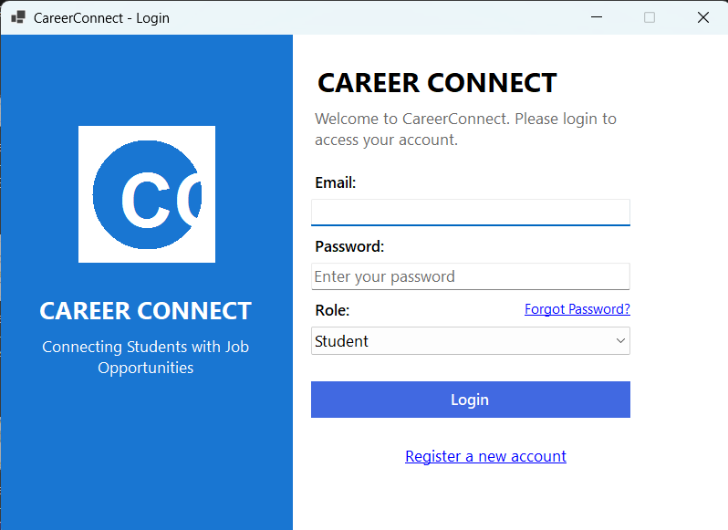
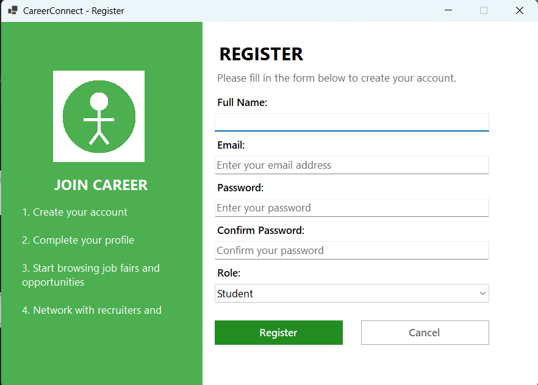

# CareerConnect - Job Fair Management System

A comprehensive platform for managing job fairs, connecting students, recruiters, and administrators.


## Project Overview

CareerConnect is designed to streamline the organization and management of job fairs at educational institutions. The system creates an efficient ecosystem for students, recruiters, coordinators, and administrators to interact seamlessly throughout the job fair lifecycle.

### Key Features

- **Multi-user platform** with role-based access control and permissions
- **End-to-end job fair management** from planning to post-event analysis
- **Applicant tracking system** for students and recruiters
- **Real-time booth management** and assignment
- **Resource allocation** for venues, staff, and equipment
- **Advanced reporting system** with analytics and insights
- **Interview scheduling** and management
- **Secure database architecture** for storing sensitive user information

## User Interface

### Landing Page


### Login Screen


### Registration Screen


## System Architecture

CareerConnect is built using a layered architecture:

- **Presentation Layer**: Windows Forms-based UI (.NET Framework)
- **Business Logic Layer**: C# class libraries implementing core functionality
- **Data Access Layer**: Entity Framework for database operations
- **Database Layer**: Microsoft SQL Server database

## User Roles

### Students
- Create and manage professional profiles
- Upload resumes and portfolios
- Register for job fairs
- Browse and apply for job postings
- Schedule and manage interviews
- Track application status

### Recruiters
- Create company profiles
- Post job opportunities
- Participate in job fairs
- Review student applications
- Schedule interviews
- Manage hiring workflows

### Coordinators
- Manage booth assignments
- Oversee check-in processes
- Provide on-site support
- Generate participation reports
- Send reminders to participants

### Administrators
- Create and manage job fair events
- Approve company and student registrations
- Generate comprehensive reports
- Monitor system activity
- Manage system settings and user accounts

## System Requirements

- Windows 10 or later
- Microsoft Visual Studio 2019 or later
- .NET Framework 4.7.2 or later
- Microsoft SQL Server 2016 Express or later
- Microsoft SQL Server Management Studio 18.0 or later

## Installation & Setup Guide

### Database Setup

1. Install Microsoft SQL Server if not already installed
2. Open Microsoft SQL Server Management Studio
3. Connect to your SQL Server instance
4. Execute the `CareerConnectDB.sql` script to create the database and tables

### Project Setup

1. Clone the repository from GitHub:
   ```
   git clone https://github.com/yourusername/JobFairManagementSystem.git
   ```

2. Open Microsoft Visual Studio
3. Open the solution file `JobFairManagementSystem.sln`
4. Restore NuGet packages:
   - Right-click on the solution in Solution Explorer
   - Select "Restore NuGet Packages"

5. Configure the database connection:
   - Open `App.config` file
   - Update the connection string to match your SQL Server instance:
   ```xml
   <connectionStrings>
     <add name="JobFairDbContext" connectionString="Data Source=YOUR_SERVER;Initial Catalog=CareerConnectDB;Integrated Security=True" providerName="System.Data.SqlClient" />
   </connectionStrings>
   ```

6. Build the solution:
   - Select "Build" > "Build Solution" from the menu
   - Or press Ctrl+Shift+B

7. Run the application:
   - Press F5 to start debugging
   - Or select "Debug" > "Start Debugging" from the menu

### First-time Login

- Use the default admin credentials:
  - Username: admin
  - Password: admin123
- It is recommended to change the default password immediately after first login

## Core Modules

### Profile Management
Allows users to create and maintain their profiles with personal information, skills, certifications, and experience.

### Job Fair Management
Comprehensive tools for creating, scheduling, and managing job fair events, including venue details, timing, and participation criteria.

### Company Management
Features for company registration, profile management, and participation tracking.

### Booth Management
Tools for assigning, tracking, and managing booth spaces during job fair events.

### Job Posting System
Platform for recruiters to post job opportunities and for students to browse and apply for positions.

### Application Tracking
System for tracking student applications across various stages of the recruitment process.

### Interview Management
Tools for scheduling, tracking, and managing interviews between students and recruiters.

### Reporting System
Comprehensive reporting tools for generating insights on fair participation, placement statistics, and recruitment metrics.

## Technologies Used

- **Frontend**: Windows Forms (.NET Framework)
- **Backend**: C# (.NET Framework)
- **Database**: Microsoft SQL Server
- **ORM**: Entity Framework
- **Version Control**: Git
- **Package Management**: NuGet

## Contributing

1. Fork the repository
2. Create your feature branch: `git checkout -b feature/amazing-feature`
3. Commit your changes: `git commit -m 'Add some amazing feature'`
4. Push to the branch: `git push origin feature/amazing-feature`
5. Open a Pull Request

## Documentation

For detailed information about system functionality, user guides, and troubleshooting, please see the [Documentation.md](JobFairManagementSystem/Documentation.md) file.
